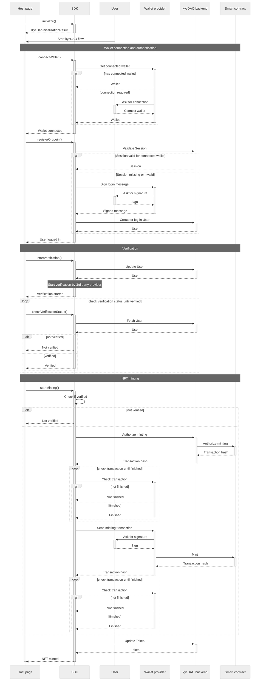

### EVM flow

The main focus of this sequence diagram is to provide a better understanding on the required interaction between the SDK and the integrating host page. Communication between our services and certain third party providers are intentionally not detailed.

:::mermaid-wrapper

:::
