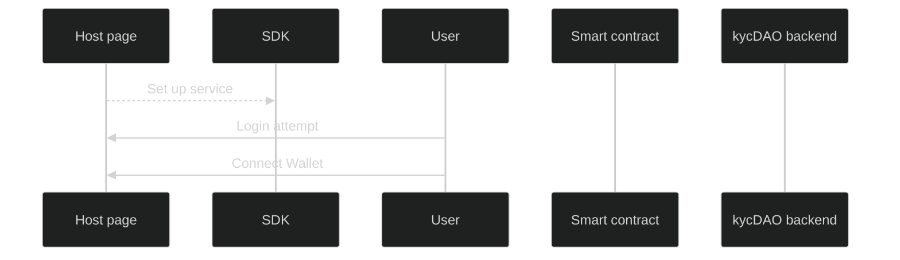

##
## https://swimlanes.io/u/FsaMtz3wf
##




Title:  SDK for KYC DAO

_: **1. Issue Verification**

Host page --> SDK: Set up service

User -> Host page: Login attempt

User -> Host page: Connect Wallet

Host page -> SDK: kycNFT exist? 

SDK -> NTNFT Contract: kycNFT exist on this wallet address?

NTNFT Contract --> SDK: No

SDK --> Host page: No

Host page -> User: Do you want to get verified?

User --> Host page: Yes.

Host page --> SDK: Start verification

NOTE Hostpage should share keys to SDK 

SDK -> kycDAO backend: send signature + address + network

kycDAO backend -> kycDAO backend: internal database check (blocklist etc.)

kycDAO backend --> SDK: User clear to proceed

SDK --> Host page: User clear to proceed

Host page -> User: Gather required data  

User -> Host page: Shares data

NOTE Information required to initiate verification => verified email, tax residency, entity type, verification type, tier type, ToS+PP

```
NEAR use case: 

Verified email - sufficient if already verified 
previously. We can also verify the email via SDK.

Tax residency - select from the list preferred. 

Entity type - Currently, only individual verification

Verification type - KYC 

ToS + PP - can be part of the NEAR Foundation's ToS + PP, but it has to be signed. 
```

Host page -> SDK: Initiate identity verification 

SDK -> SDK: Load IDV provider

SDK -> User: Identity Verification 

User -> SDK: finalize identity verification

SDK -> kycDAO backend: wait for callback from IDV provider 

kycDAO backend --> SDK: IDV process success

SDK -> kycDAO backend: Authorize minting

kycDAO backend -> NTNFT Contract: Authorize wallet address 

NTNFT Contract --> kycDAO backend: Authorized.

kycDAO backend --> SDK: Authorized to mint

SDK --> Host page: Authorized to mint

Host page -> User: Ready to mint?

User --> Host page: Let's roll. 

NOTE Information required before minting => NFT image selection signed disclaimer

```
NFT image - provided by NEAR? Provided by the User? Any preference? 

Signed disclaimer - Important for liability management.
```

Host page -> NTNFT Contract: Mint through NEAR wallet

...: {fas-spinner} Wait for minting

User <-- NTNFT Contract: Receive kycNFT + validity + tier

User --> Host page: Mint successful (return tx ID)

Host page -> SDK: return tx ID

SDK -> kycDAO backend: return tx ID

Host page -> SDK: get kycNFT details

SDK --> Host page: share detiails (JS object) 

Host page -> Host page: Show kycNFT

_: **2. Gating**

User -> Host page: Login attempt

User -> Host page: Connect Wallet

Host page -> SDK: kycNFT exist? 

SDK -> NTNFT Contract: kycNFT exist on this wallet address?

NTNFT Contract --> SDK: Yes/No

SDK --> Host page: Yes/No

